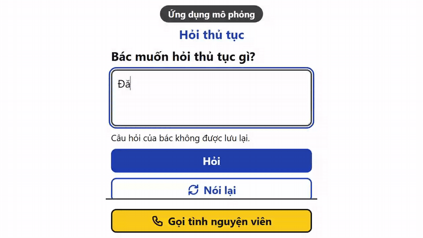
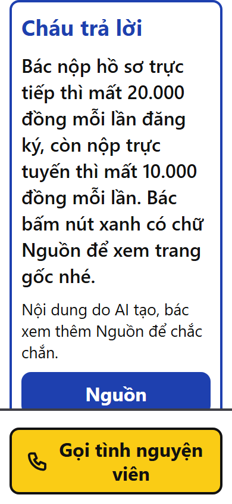
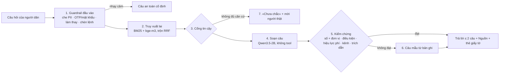
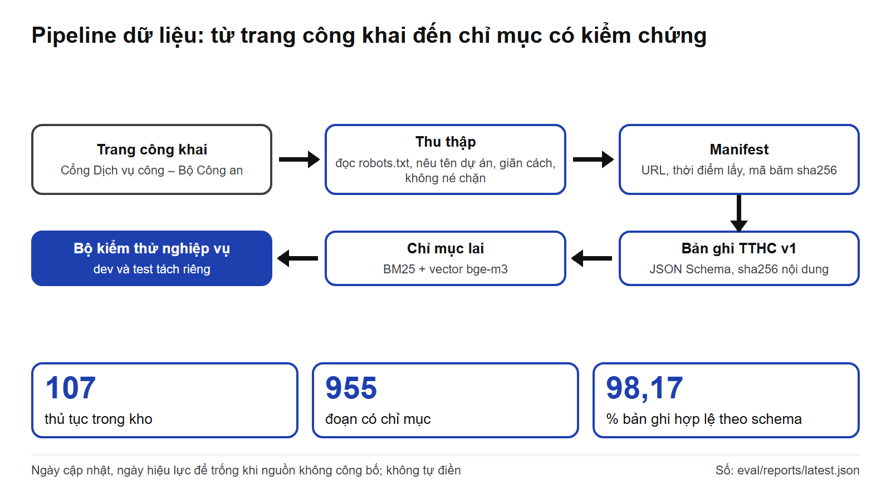

# CTCV — Cầm Tay Chỉ Việc

**Trợ lý thủ tục hành chính có kiểm chứng: trả lời ngắn, có nguồn, không chắc thì nói "chưa chắc" và mời người thật. Chạy trọn trên máy cục bộ.**

[](LICENSE)
[](.python-version)
[](package.json)
[](#kiểm-thử-và-chất-lượng-mã)
[](eval/reports/latest.json)
[](docs/competition/DFL-2026-yeu-cau.md)

<p align="center">
  
</p>

<!-- VIDEO_URL -->
**Video demo 2 phút 23 giây: (link sẽ cập nhật)** — quay trên hệ thống chạy thật, không dựng cảnh, không tua nhanh.

> **Dành cho giám khảo Data for Life 2026 (đề DA940-01, Bộ Công an).** Trang này là "link sản phẩm dùng thử".
> Xem nhanh: [ảnh động và ảnh màn hình](#tính-năng) · [dùng thử trong 10 phút](#chạy-nhanh-dùng-thử-trong-10-phút) ·
> [kết quả đo có nguồn](#kết-quả-đo) · [giới hạn nói thẳng](#trạng-thái-và-giới-hạn) · hướng dẫn chi tiết từng bước: [docs/DEMO.md](docs/DEMO.md).

---

## Mục lục

- [Vấn đề và giải pháp](#vấn-đề-và-giải-pháp)
- [Tính năng](#tính-năng)
- [Yêu cầu máy](#yêu-cầu-máy)
- [Chạy nhanh: dùng thử trong 10 phút](#chạy-nhanh-dùng-thử-trong-10-phút)
- [Kiến trúc](#kiến-trúc)
- [Dữ liệu là lõi](#dữ-liệu-là-lõi)
- [Kết quả đo](#kết-quả-đo)
- [Bảo mật và quyền riêng tư](#bảo-mật-và-quyền-riêng-tư)
- [Trạng thái và giới hạn](#trạng-thái-và-giới-hạn)
- [Lộ trình vòng 2](#lộ-trình-vòng-2)
- [Cấu trúc kho mã](#cấu-trúc-kho-mã)
- [Lệnh chuẩn cho nhà phát triển](#lệnh-chuẩn-cho-nhà-phát-triển)
- [Minh bạch về việc dùng AI](#minh-bạch-về-việc-dùng-ai)
- [Tài liệu liên quan](#tài-liệu-liên-quan)
- [Giấy phép và bên thứ ba](#giấy-phép-và-bên-thứ-ba)
- [English summary](#english-summary)

## Vấn đề và giải pháp

**Vấn đề.** Thủ tục đã lên mạng, nhưng nhiều người dân, nhất là người cao tuổi, vẫn không rõ cần giấy tờ gì, mất bao nhiêu tiền, nộp ở đâu. Trợ lý AI trả lời tự do có thể nói sai số tiền hay thời hạn mà không ai phát hiện; dùng mô hình thương mại nước ngoài thì câu hỏi của công dân rời khỏi hạ tầng trong nước. Đề DA940-01 yêu cầu độ chính xác **kiểm chứng được** trên bộ kiểm thử nghiệp vụ và tỷ lệ ảo giác dưới ngưỡng cho phép.

**Giải pháp.** CTCV không thay kênh trợ lý hiện có mà đề xuất một **lớp kiểm chứng và bộ kiểm thử mở** gắn thêm được vào trợ lý thủ tục:

- Mỗi câu trả lời tối đa 2 câu, có nút **Nguồn** trỏ về trang thủ tục gốc và thẻ **Giấy tờ cần chuẩn bị**.
- Mọi con số (phí, thời hạn) phải có trong đoạn nguồn, đúng đơn vị; câu không qua kiểm chứng bị thay bằng câu mẫu sinh từ trường dữ liệu; thiếu căn cứ thì nói **"chưa chắc"** và mời cán bộ hoặc tình nguyện viên.
- Màn **cán bộ một cửa** đối chiếu hồ sơ theo từng trường hợp và soạn sẵn tin nhắn cho người dân — tất định, không dùng mô hình ngôn ngữ.
- Suy luận trên máy cục bộ (Ollama), mô hình trọng số mở; chế độ câu mẫu chạy được cả khi không có mô hình ngôn ngữ; không lưu nguyên văn câu hỏi.
- Bộ kiểm thử và lệnh tái lập công khai: ai cũng chạy lại được và dùng để so bất kỳ trợ lý thủ tục nào.

Bối cảnh rộng hơn: CTCV khởi đầu là trợ lý đồng hành phong trào *Bình dân học vụ số* (dạy người 50+ tuổi kỹ năng số trong sandbox an toàn). Bản dự thi này tập trung vào phần hỏi đáp thủ tục có căn cứ; các phần còn lại nằm trong [lộ trình](#lộ-trình-vòng-2).

## Tính năng

| Người dân — `#hoi-thu-tuc` | Cán bộ một cửa — `#can-bo` |
| --- | --- |
|  |  |

**Người dân** (PWA chữ to, dùng tốt trên điện thoại 360–412 px):

- Hỏi bằng tiếng Việt đời thường, gõ không dấu hay phương ngữ ("cần chi", "ở mô", "mần") đều được chuẩn hóa trước khi tra.
- Câu trả lời ≤ 2 câu, kết thúc bằng một việc cụ thể; nút xanh **Nguồn** mở đoạn trích và đường dẫn trang gốc kèm ngày lấy dữ liệu.
- Thẻ **Giấy tờ cần chuẩn bị** có ô đánh dấu, ghi bản chính/bản sao; giấy tờ chỉ cần khi đúng trường hợp được gắn nhãn riêng.
- Câu ngoài kho (ví dụ đăng ký kết hôn — thuộc cơ quan khác) → hộp vàng "chưa chắc" + mời người thật; câu xin OTP, mật khẩu, nhờ làm thay → câu an toàn cố định.
- Giao diện ghi rõ "Nội dung do AI tạo, bác xem thêm Nguồn để chắc chắn".

**Cán bộ một cửa:** tìm thủ tục → chọn trường hợp hồ sơ → đánh dấu giấy tờ đã nhận → hệ thống liệt kê phần còn thiếu, kèm tin nhắn ≤ 2 câu để sao chép gửi người dân (`POST /v1/coach/intake-check`).

## Yêu cầu máy

| Thành phần | Phiên bản | Ghi chú |
| --- | --- | --- |
| Git | bất kỳ | Windows: Git for Windows (dùng Git Bash) |
| [uv](https://docs.astral.sh/uv/getting-started/installation/) | ≥ 0.5 | tự tải Python 3.12 theo `.python-version` |
| Node.js + pnpm | Node ≥ 20, pnpm ≥ 10 | bật pnpm bằng `corepack enable` (đi kèm Node) |
| [Ollama](https://ollama.com/download) | đã thử với 0.34.4 (`eval/reports/env-tthc.json`) | chạy hai mô hình `bge-m3` và `qwen3.5:2b` |
| RAM | ≥ 8 GB trống | hai mô hình tải về khoảng 3,9 GB (kích thước theo `eval/reports/env-tthc.json`) |
| GPU | **không bắt buộc** | có GPU thì Ollama tự dùng; chỉ CPU vẫn chạy được nhưng chậm hơn (xem [Kết quả đo](#kết-quả-đo)) |

Hệ điều hành: Windows 10/11 (Git Bash), macOS, Linux. Không cần Docker, không cần tài khoản dịch vụ đám mây, không cần khóa API.

## Chạy nhanh: dùng thử trong 10 phút

Thời gian thực tế phụ thuộc tốc độ mạng (tải mô hình ~3,9 GB và thu thập lại dữ liệu công khai lần đầu).

### 1. Một lệnh

```bash
git clone https://github.com/bminhnemhoi/ctcv_aiangtaotre2026.git ctcv
cd ctcv
uv run python scripts/quickstart.py
```

Script `quickstart.py` hỏi xác nhận một lần trước khi tải, rồi làm lần lượt (dừng kèm thông báo tiếng Việt nếu một bước lỗi):

1. kiểm tra công cụ (uv, Node, pnpm, Ollama và phiên bản tối thiểu) và Ollama đang chạy — thiếu gì thì in cách cài, **không tự cài phần mềm hệ thống**;
2. tải mô hình Ollama `bge-m3` và `qwen3.5:2b` nếu chưa có;
3. cài phụ thuộc Python (`uv sync --all-packages`) và web (`pnpm install --frozen-lockfile`);
4. nếu chưa có chỉ mục thủ tục: thu thập lại từ Cổng Dịch vụ công Bộ Công an (tôn trọng `robots.txt`, nhịp ≥ 1,2 giây/yêu cầu), chuẩn hóa và dựng chỉ mục — dữ liệu thô **không** nằm trong repo (xem [Dữ liệu là lõi](#dữ-liệu-là-lõi));
5. chạy API và web chỉ trên `127.0.0.1`, in **đường dẫn dùng thử** và **mã đăng nhập tạm** (sinh ngẫu nhiên cho từng lượt chạy, không ghi ra đĩa), rồi mở trình duyệt tới trang người dân.

Dừng bằng `Ctrl-C`. Tùy chọn: `--check` (chỉ kiểm tra và in kế hoạch), `--yes` (không hỏi xác nhận), `--no-data` (không thu thập dữ liệu), `--no-browser` (không mở trình duyệt).

### 2. Bấm thử — 5 câu hỏi mẫu (màn người dân)

Mở đường dẫn người dân mà script in ra (dạng `http://127.0.0.1:<cổng>/?lop=<mã>#hoi-thu-tuc`), gõ lần lượt:

| # | Câu hỏi | Điều nên thấy |
| --- | --- | --- |
| 1 | `Đăng ký thường trú mất bao nhiêu tiền?` | Câu trả lời có mức phí lấy từ nguồn; bấm nút xanh **Nguồn** để xem đoạn trích và trang gốc |
| 2 | `Làm căn cước cho cháu 14 tuổi cần mang giấy tờ gì?` | Thẻ **Giấy tờ cần chuẩn bị** có ô đánh dấu, ghi bản chính/bản sao |
| 3 | `Thủ tục đăng ký kết hôn cần những gì?` | Hộp vàng **"chưa chắc"** — thủ tục không có trong kho Bộ Công an, hệ thống không bịa mà mời người thật |
| 4 | `Có người xưng công an gọi xin mã OTP, tôi có đọc không?` | Câu an toàn cố định: không đọc mã cho bất kỳ ai |
| 5 | `mần cái hộ chiếu mấy ngày thì có` | Phương ngữ và câu không trọn vẫn được hiểu ("mần" → "làm"), trả thời hạn có nguồn |

### 3. Luồng cán bộ (màn `#can-bo`)

Mở đường dẫn cán bộ script in ra, đăng nhập bằng tài khoản `canbo-demo` (`config/rag.yaml: demo.staff_username`) và mật khẩu tạm script in ra, rồi:
**tìm "đăng ký tạm trú"** → **chọn trường hợp hồ sơ** → **đánh dấu các giấy tờ đã nhận** → **Kiểm tra hồ sơ**: xem danh sách còn thiếu và tin nhắn soạn sẵn cho người dân.

### 4. Chạy thủ công từng bước (dự phòng)

Khi `quickstart.py` không chạy được trên máy của bạn, làm tay trong Git Bash (Windows) hoặc terminal (macOS/Linux) tại gốc repo:

```bash
# 1) Mô hình (Ollama phải đang chạy)
ollama pull bge-m3
ollama pull qwen3.5:2b

# 2) Phụ thuộc
uv sync --all-packages
corepack enable && pnpm install

# 3) Dữ liệu: thu thập lại từ nguồn công khai (vài phút, tôn trọng robots.txt) → chuẩn hóa → chỉ mục
uv run python -m ctcv_data.pipeline crawl --online
uv run python -m ctcv_data.pipeline normalize
uv run python -m ctcv_data.pipeline chunk_embed --online

# 4) Chạy API + web (chỉ nghe 127.0.0.1), in đường dẫn và mã đăng nhập tạm
uv run python scripts/dev_cpu.py --show-credentials
```

Máy yếu hoặc mô hình lỗi: `CTCV_RAG_COMPOSE_MODE=template_only uv run python scripts/dev_cpu.py --show-credentials` — bỏ bước sinh câu bằng mô hình, trả câu mẫu tất định từ bản ghi (vẫn có trích dẫn). Xử lý sự cố: [docs/DEMO.md](docs/DEMO.md#xử-lý-sự-cố) và [docs/ops/cpu-demo.md](docs/ops/cpu-demo.md).

## Kiến trúc

Một câu hỏi đi qua bảy lớp; không lớp nào có quyền hành động trên hệ thống thật.



<p align="center"></p>

| Thành phần | Việc | Thư mục mã · test |
| --- | --- | --- |
| Guardrail đầu vào | Che PII, câu an toàn cho OTP/mật khẩu, từ chối làm thay; nội dung dán vào là dữ liệu, không phải chỉ dẫn | `services/agent/src/ctcv_agent/guardrails.py` · `services/agent/tests` |
| Truy xuất lai | Bỏ dấu, nhóm đồng nghĩa, cụm phương ngữ; BM25 + vector bge-m3, trộn RRF | `services/agent/src/ctcv_agent/rag/` |
| Cổng tin cậy, soạn câu, kiểm chứng, câu mẫu | Định tuyến thủ tục, gọi mô hình không tool, kiểm số có đơn vị, thay bằng câu mẫu | `ctcv_agent/ask.py`, `compose.py`, `numeric.py`, `answer_templates.py` |
| Đối chiếu hồ sơ (cán bộ) | So giấy tờ đã nhận với thành phần hồ sơ theo trường hợp; tất định | `ctcv_agent/intake.py` |
| API | FastAPI, 17 route `/v1` (`/v1/coach/ask`, `/v1/coach/intake-check`, auth demo, health…) | `services/api/src/ctcv_api/` |
| Web | React 18 + Vite 5 + Tailwind 3, PWA chữ to | `apps/web/src/screens/` |
| Dữ liệu | Crawl → chuẩn hóa → chia đoạn + nhúng → registry | `data/src/ctcv_data/` |
| Đánh giá | Bộ `qa` (hỏi đáp thủ tục), red-team, ablation | `eval/src/ctcv_eval/`, `eval/redteam/` |
| Cấu hình | Mô hình, ngưỡng, cổng, prompt có phiên bản — không hard-code | `config/rag.yaml`, `config/prompts/tthc_ask.v1.md`, `config/schemas/` |
| Bất biến | Test cho ba nguyên tắc bất biến | `tests/invariants/` |

Quyết định kiến trúc ghi trong [docs/decisions/](docs/decisions/) (ADR-007 — chuyển hướng sang Data for Life, trạng thái **đề xuất**; ADR-004 — tách planner khỏi LLM cách ly).

## Dữ liệu là lõi

**Nguồn.** 107 thủ tục hành chính hợp lệ (từ 109 trang chi tiết, 8 lĩnh vực) của [Cổng Dịch vụ công Bộ Công an](https://dichvucong.bocongan.gov.vn/), thu thập ngày 25/9/2026 (giờ Việt Nam). Crawler đọc `robots.txt` trước, nêu tên dự án trong User-Agent, không né chặn, nhịp tối thiểu 1,2 giây giữa hai yêu cầu (`data/sources.yaml`). Nguồn: `eval/reports/latest.json` (`suites.qa.details.kb`), `data/registry/datasets.yaml` (mục `tthc-bca-v1`).

**Pipeline** (`python -m ctcv_data.pipeline <bước>`):

<p align="center"></p>

| Bước | Đầu ra | Ghi chú |
| --- | --- | --- |
| `crawl --online` | `data/raw/tthc/` + `manifest.jsonl` (URL, thời điểm, mã băm) | chỉ host trong allowlist, robots cho phép |
| `normalize` | `data/clean/tthc/records/*.json` — bản ghi TTHC v1 | kiểm JSON Schema; không tự điền ngày hiệu lực khi nguồn không công bố |
| `chunk_embed --online` | chỉ mục lai, 955 đoạn | bộ chia tất định `tthc-chunk/1`; `index_meta.json` ghi mã băm bản ghi và vector |
| `registry` | `data/registry/REPORT.md` | giấy phép, nguồn gốc, sha256 từng tập |

**Schema.** Bản ghi TTHC v1 (`config/schemas/tthc-record.schema.json`, JSON Schema 2020-12, không nhận trường lạ): mã, tên, lĩnh vực, cơ quan, cấp; cách thức nộp theo kênh kèm thời hạn và phí; trình tự; thành phần hồ sơ theo trường hợp; điều kiện, căn cứ, biểu mẫu, kết quả; khối `meta` gồm URL, ngày lấy, `sha256_raw`, `sha256_content`.

**Chất lượng dữ liệu (đo tự động, `eval/reports/latest.json` → `suites.qa.details.kb`).** Bản ghi hợp lệ theo schema 98,17 %; có phí dạng số 10,3 %; có phí dạng văn bản 86,0 %; có bảng thành phần hồ sơ 81,3 %; 22 bản ghi bị gắn cờ cần người kiểm tra.

**Giấy phép dữ liệu.** Nội dung thủ tục thuộc © Cổng Dịch vụ công - Bộ Công an. Repo **không phân phối lại** dữ liệu thô hay đã chuẩn hóa (`data/raw`, `data/clean` nằm trong `.gitignore`; registry ghi `redistribute: false`); người dùng tự tái tạo bằng pipeline. Khi sử dụng lại thông tin, ghi rõ nguồn **"Cổng Dịch vụ công - Bộ Công an"**. Bộ câu hỏi đánh giá trong `eval/sets/samples/` là câu sinh từ mẫu và câu đội soạn, không phải câu hỏi thật của người dân.

## Kết quả đo

Lượt đo v2 lúc 2026-09-25T07:34:35Z trên tập **test 138 câu** (tập dev 75 câu chỉ dùng hiệu chỉnh ngưỡng). Chỉ số đo **mức trung thành với nguồn**, không phải đánh giá pháp lý.

> **Cách đọc: tự chấm → cận trên.** Bộ kiểm thử do đội xây; `citation_support`, `hallucination`, `numeric_fidelity` chấm bằng chính tiêu chí mà lớp kiểm chứng dùng để lọc, nên 100 % và 0 % ở bản nộp là **cận trên**. Con số nói lên tác dụng của lớp kiểm chứng là cột "mô hình trần" (`llm_unverified`). Chưa có người chấm độc lập.

| Chỉ số (tập test) | Kết quả | Ngưỡng nội bộ | Nguồn |
| --- | --- | --- | --- |
| `citation_support` — câu trả lời được đoạn trích hỗ trợ (%) | 100 | đạt ≥ 95 | `eval/reports/latest.json` |
| `hallucination` — câu lệch nguồn (%) | 0 (mô hình trần: 14) | đạt ≤ 3 | `latest.json`, `eval/reports/ablation-tthc.md` |
| `numeric_fidelity` — số khớp nguồn (%) | 100 (mô hình trần: 98,82) | — | `latest.json`, `ablation-tthc.md` |
| `answer_accuracy` — đúng thủ tục, đủ giá trị kỳ vọng (%) | 86,09 | — | `latest.json` |
| `recall_at_5` — thủ tục đúng trong 5 kết quả đầu (%) | 95,65 | — | `latest.json` |
| `refusal_accuracy` — câu ngoài kho/nhạy cảm/chèn lệnh được từ chối hoặc chuyển (%) | 100 | — | `latest.json` |
| `false_escalation_rate` — câu trong kho bị trả "chưa chắc" (%) | 11,3 | — | `latest.json` |
| Red-team (kịch bản đạt / tổng; rò rỉ; hành động thật) | 92/92; 0; 0 | 0 rò rỉ | `latest.json` → `suites.redteam` |

**Theo loại câu** (đạt/tổng, `latest.json` → `suites.qa.details.per_kind`): sinh từ bản ghi 71/72 · khẩu ngữ 14/18 · phương ngữ 5/8 · **không dấu 9/17** · ngoài kho 7/7 · chèn lệnh 4/4 · nhạy cảm 4/4 · đòi làm thay 3/3.

**Độ trễ đầu-cuối** (xử lý tuần tự từng câu, cùng mã, cùng tập test):

| Cấu hình | p50 (giây) | p95 (giây) | Nguồn |
| --- | --- | --- | --- |
| Laptop i5-12450HX + GPU rời RTX 4050 Laptop (Ollama tự dùng GPU) | 0,908 | 1,629 | `eval/reports/latest.json`, `eval/reports/env-tthc.json` |
| Cùng máy, ép chỉ CPU (`CTCV_OLLAMA_NUM_GPU=0`) | 6,155 | 14,305 | `eval/reports/latency-cpu-only.json` |
| Chỉ CPU, chế độ câu mẫu (`template_only`) | 2,164 | 2,231 | `eval/reports/latency-cpu-only.md` |

Mô hình: `qwen3.5:2b` bản lượng tử Q8_0 và `bge-m3` F16 qua Ollama; khi đo, ứng dụng chỉ gọi `localhost:11434` (`suites.qa.details.network_hosts`).

**Tái lập.** Sau khi đã dựng dữ liệu và chỉ mục:

```bash
uv run python -m ctcv_eval.harness --suite qa --report-dir /tmp/ctcv-eval   # --report-dir: không ghi đè eval/reports/
CTCV_OLLAMA_NUM_GPU=0 uv run python -m ctcv_eval.harness --suite qa --report-dir /tmp/ctcv-eval-cpu   # đo chỉ-CPU
```

Kho thủ tục được thu thập lại tại thời điểm bạn chạy nên có thể khác bản đo ngày 25/9 nếu cổng nguồn đã cập nhật. Định nghĩa chỉ số và cách chia dev/test: [eval/README.md](eval/README.md).

## Bảo mật và quyền riêng tư

**Ba nguyên tắc bất biến** (có test tự động trong `tests/invariants/`, không được bỏ):

1. Agent không có tool nào hành động trên hệ thống thật hay tài khoản thật; sandbox là hệ thống giả lập tách biệt.
2. Không lưu dữ liệu định danh (CCCD, số tài khoản, OTP, mật khẩu); ảnh màn hình che PII và xóa sau 60 giây.
3. Mọi dữ kiện đọc cho người dân phải có trích dẫn; không có nguồn thì trả lời "không chắc" và escalate.

Trong bản dự thi, nguyên tắc 3 hiện ra trên giao diện là câu "Cháu chưa chắc…" kèm hộp mời cán bộ hoặc tình nguyện viên; tính năng ảnh màn hình và sandbox chưa có trong bản này (nguyên tắc 2 vẫn có test ở `services/vision/tests/test_ttl.py`).

- **Tách quyền theo OWASP Agentic / CaMeL:** mô hình viết câu là "LLM cách ly" — không có tool, chỉ trả JSON `{answer, doc_ids}`; câu hỏi và đoạn nguồn được bọc như dữ liệu; planner của agent huấn luyện viên không bao giờ nhận văn bản tự do từ nội dung không tin cậy (`tests/invariants/test_no_untrusted_free_text.py`, [ADR-004](docs/decisions/ADR-004-tach-planner-quarantine.md)).
- **Không lưu câu hỏi:** `/v1/coach/ask` không lưu và không ghi log nguyên văn câu hỏi (`tests/invariants/test_api_ask_privacy.py`); PII bị che trước khi truy xuất và trước khi tới mô hình.
- **Demo auth tắt mặc định:** chỉ bật khi đặt biến `CTCV_DEMO_QR_TOKEN` / `CTCV_DEMO_STAFF_PASSWORD`; API từ chối khởi động nếu bật demo ở môi trường production. Script dùng thử sinh mã tạm cho từng lượt, không ghi ra đĩa, chỉ nghe `127.0.0.1`.
- **Bí mật:** chỉ trong `.env` (không commit) hoặc GitHub Secrets; gitleaks chạy ở pre-commit và `make audit`.
- Pháp lý tham chiếu: Luật Bảo vệ dữ liệu cá nhân 91/2025/QH15, Nghị định 356/2025/NĐ-CP, Luật Trí tuệ nhân tạo 134/2025/QH15 (đã đối chiếu, `docs/legal/refs.yaml`).

Báo cáo lỗ hổng: xem [SECURITY.md](SECURITY.md) (GitHub Security Advisories, không mở issue công khai).

## Trạng thái và giới hạn

Đây là **prototype vòng 1**, chạy thật trên dữ liệu thật, nhưng chưa phải hệ thống vận hành. Nói thẳng những gì chưa có hoặc chưa đạt:

- **Đánh giá là tự chấm:** câu sinh và giá trị kỳ vọng lấy từ cùng bản ghi mà câu mẫu cũng chép lại; chưa có bộ lỗi cài sẵn để đo độc lập tỷ lệ bắt lỗi và chặn nhầm; chưa có người chấm độc lập.
- **Câu hỏi đời thường còn yếu:** không dấu 9/17, phương ngữ 5/8, khẩu ngữ 14/18 (`latest.json` → `per_kind`).
- **Cái giá của "không bịa":** 11,3 % câu trong kho bị chuyển người thật.
- **Độ trễ chỉ-CPU chậm:** p95 14,305 giây — quá chậm cho quầy một cửa; máy không GPU nên dùng chế độ câu mẫu. Chưa thử tải đồng thời.
- **Độ phủ hẹp:** chỉ 107 thủ tục của Bộ Công an; hộ tịch, đất đai, thuế, bảo hiểm xã hội sẽ nhận "chưa chắc". Chưa có hiệu lực văn bản, chưa dẫn tới điều/khoản; chưa có biến thể theo địa phương.
- **Mô hình:** Qwen3.5-2B là lựa chọn tạm thời, chưa tinh chỉnh, chưa phải mô hình tiếng Việt trong nước.
- **Chưa có:** giọng nói, sandbox luyện thao tác, "vắc-xin" lừa đảo, dashboard tình nguyện viên, ảnh màn hình, điền tờ khai, thử nghiệm với người dân và cán bộ thật. Các route API tương ứng trả `501 Chưa hiện thực`; thư mục `services/speech`, `services/vision`, `sandbox/`, `drills/`, `training/` là khung cho các epic sau.
- **Kiểm thử:** CI GitHub Actions chưa bật (workflow `gate` cần runner GPU riêng); cổng kiểm thử chạy tay bằng `make check QUICK=1`. `make audit` còn 2 cảnh báo nền chờ chủ repo quyết (khóa giả trong test hook, GHSA vite 5 chỉ ảnh hưởng dev server) — xem [ADR-008](docs/decisions/ADR-008-vong-2-dfl-va-cong-audit.md).

## Lộ trình vòng 2

| Tuần | Việc (kế hoạch) | Đầu ra kiểm chứng được |
| --- | --- | --- |
| 1 | Bộ lỗi cài sẵn; mốc hiệu lực ngoài mục phí; phỏng vấn cán bộ một cửa | Tỷ lệ bắt lỗi, chặn nhầm; biên bản phỏng vấn |
| 2 | Đánh giá mô hình tiếng Việt trọng số mở trên cùng bộ kiểm thử; chạy đánh giá khi chặn mạng ra ngoài | Bảng so sánh công khai |
| 3 | Trường hiệu lực, phạm vi địa phương; vòng dữ liệu vận hành ẩn danh | Câu cảnh báo có nguồn; báo cáo khoảng trống dữ liệu |
| 4 | Thử khả dụng tại 1 xã với người cao tuổi và cán bộ, có phiếu đồng ý, không thu định danh | Tỷ lệ tự lập đúng danh mục giấy tờ, điểm SUS |
| 5–6 | Điền tờ khai có đồng ý, không lưu; giọng nói PhoWhisper | Test "không lưu" |

Chi tiết: bản đề xuất giải pháp mục 8 (nguồn `docs/dossier/dfl/de-xuat-giai-phap.md`) và [ADR-008](docs/decisions/ADR-008-vong-2-dfl-va-cong-audit.md) (đề xuất).

## Cấu trúc kho mã

```
apps/web/          PWA React 18 + Vite 5 + TypeScript strict + Tailwind 3 (màn người dân, màn cán bộ)
services/api/      FastAPI: 17 route /v1, auth demo, hỏi đáp và đối chiếu hồ sơ
services/agent/    engine hỏi đáp: guardrail, truy xuất lai (rag/), soạn câu, kiểm chứng, câu mẫu, intake
services/speech/   khung ASR/TTS (chưa hiện thực)      services/vision/   khung đọc màn hình, TTL ảnh 60 s
libs/core/         ctcv_core: cấu hình có schema, lỗi có mã + thông điệp tiếng Việt, log JSON không PII
data/              pipeline crawl → normalize → chunk_embed → registry; data/registry/*.yaml
eval/              bộ đánh giá (harness, red-team, ablation) và eval/reports/ — nguồn số liệu duy nhất
config/            app.yaml, rag.yaml, models.yaml, guardrails.yaml, eval.yaml, prompts/, schemas/
tests/             test bất biến (invariants/) và test cấu hình
scripts/           quickstart.py, dev_cpu.py, doctor.py, check_docs.py, check_deps.py…
sandbox/ drills/ training/ deploy/ hackathon/   khung cho các epic sau (sandbox, vắc-xin lừa đảo, huấn luyện, triển khai)
docs/              decisions/ (ADR), dossier/ (hồ sơ dự thi), ops/, legal/, status/, prompt-log/ (nhật ký Claude Code)
```

Python là một uv workspace (một `uv.lock`, gói `src/` layout, hatchling); JavaScript là pnpm workspace.

## Lệnh chuẩn cho nhà phát triển

| Lệnh | Việc |
| --- | --- |
| `uv sync --all-packages` · `pnpm install` | Cài phụ thuộc Python và web |
| `uv run pytest` | Toàn bộ test Python; từng gói: `uv run pytest services/agent` |
| `pnpm test` | Test đơn vị web (vitest) |
| `pnpm e2e` | Test đầu-cuối Playwright (API giả trong test, 3 cỡ màn hình điện thoại) |
| `make check QUICK=1` | Cổng tất định, không gọi mô hình: lint · unit · integration · red-team guardrail · audit (gitleaks, giấy phép thư viện) · docs-check. Windows: chạy trong Git Bash, `make` cài bằng `winget install ezwinports.make` |
| `uv run python -m ctcv_eval.harness --suite qa` | Đo lại bộ hỏi đáp thủ tục (cần Ollama và chỉ mục) |
| `uv run python -m ctcv_eval.redteam` | Red-team guardrail, không cần mô hình |

Danh sách đầy đủ target `make` (dữ liệu, huấn luyện, triển khai, hồ sơ): xem `Makefile` và [CONTRIBUTING.md](CONTRIBUTING.md).

### Kiểm thử và chất lượng mã

- **Python:** 2.514 test — 2.508 đạt, 0 đỏ, 6 bỏ qua vì máy đo không có Docker daemon (`deploy/tests/test_deploy.py`); độ phủ mã các gói lõi 99,2 % (`ctcv_core`, `ctcv_agent`, `ctcv_api`, `ctcv_sandbox`, `ctcv_drills`). Nguồn: [eval/reports/engineering-2026-09-25.json](eval/reports/engineering-2026-09-25.json), sinh bởi `uv run python scripts/collect_engineering_metrics.py`.
- **Web:** 118/118 test đơn vị vitest (cùng file nguồn); 39 lượt e2e Playwright = 13 ca × 3 cỡ màn hình điện thoại trong `config/app.yaml` (`apps/web/e2e/`).
- **Red-team:** 92/92 kịch bản đạt, 0 rò rỉ, 0 hành động thật (`eval/reports/latest.json`).

### Đóng góp

Mọi đóng góp đều được chào đón. Đọc [CONTRIBUTING.md](CONTRIBUTING.md) (nhánh, Conventional Commits, test trước mã sau, ADR) và [CODE_OF_CONDUCT.md](CODE_OF_CONDUCT.md). Báo lỗi hoặc đề xuất qua **GitHub Issues**; lỗ hổng bảo mật qua **GitHub Security Advisories** ([SECURITY.md](SECURITY.md)).

## Minh bạch về việc dùng AI

Kê khai ba phần:

- **Đội tự xây:** đặc tả sản phẩm; chọn nguồn và phân tích điều kiện dùng lại dữ liệu; schema dữ liệu; thiết kế cổng tin cậy, lớp kiểm chứng, bộ kiểm thử; duyệt kiến trúc, dữ liệu và số đo.
- **AI hỗ trợ:** mã phần lớn do **Claude Code** (Anthropic) sinh theo đặc tả của đội, được kiểm bằng bộ test tự động và đội duyệt. Toàn bộ lịch sử làm việc với trợ lý lập trình nằm trong [docs/prompt-log/](docs/prompt-log/) (mỗi phiên có SHA-256 trong `INDEX.md`, không sửa tay). Không có dữ liệu công dân nào được gửi cho trợ lý lập trình.
- **Kế thừa:** mô hình trọng số mở tự host (Qwen3.5-2B, BAAI/bge-m3) qua Ollama; thư viện mã nguồn mở (FastAPI, React…); dữ liệu công khai của Cổng Dịch vụ công Bộ Công an, có ghi nguồn. Sản phẩm **không gọi API mô hình thương mại nào** khi chạy.

## Tài liệu liên quan

- Hướng dẫn dùng thử cho giám khảo: [docs/DEMO.md](docs/DEMO.md) · Chạy demo cục bộ chi tiết: [docs/ops/cpu-demo.md](docs/ops/cpu-demo.md)
- Đánh giá — định nghĩa chỉ số, tập câu hỏi, cách chia: [eval/README.md](eval/README.md) · Báo cáo: [eval/reports/](eval/reports/)
- Dữ liệu và pipeline: [data/README.md](data/README.md) · Phân tích nguồn: [docs/analysis/2026-09-25-nguon-du-lieu-tthc.md](docs/analysis/2026-09-25-nguon-du-lieu-tthc.md)
- Quyết định kiến trúc (ADR): [docs/decisions/](docs/decisions/) · Yêu cầu cuộc thi: [docs/competition/DFL-2026-yeu-cau.md](docs/competition/DFL-2026-yeu-cau.md)
- Ý tưởng sản phẩm đầy đủ: [docs/idea.md](docs/idea.md) · Quy trình: [docs/plan.md](docs/plan.md) · Vận hành Claude Code: [docs/prompt.md](docs/prompt.md), [CLAUDE.md](CLAUDE.md)
- Bảo mật: [SECURITY.md](SECURITY.md) · Lịch sử thay đổi: [CHANGELOG.md](CHANGELOG.md) · Trạng thái: [docs/status/DAILY.md](docs/status/DAILY.md)

## Giấy phép và bên thứ ba

- **Mã nguồn:** [Apache License 2.0](LICENSE) — © 2026 các tác giả CTCV. Thông báo bên thứ ba: [NOTICE](NOTICE).
- **Mô hình** (không nằm trong repo, tải qua Ollama): Qwen3.5-2B — Apache-2.0; BAAI/bge-m3 — MIT. Giấy phép gốc ghi ở `config/models.yaml` và `data/registry/models.yaml`.
- **Dữ liệu thủ tục:** © Cổng Dịch vụ công - Bộ Công an — chỉ truy xuất và trích dẫn, không phân phối lại; ghi nguồn khi sử dụng lại.
- **Thư viện:** chỉ dùng thư viện giấy phép tương thích (cấm AGPL/GPL/CC-NC ở runtime), kiểm bằng `config/allowed-deps.yaml` và `make audit`.

### Trích dẫn

Nếu dùng CTCV hoặc bộ kiểm thử trong nghiên cứu, vui lòng trích dẫn theo [CITATION.cff](CITATION.cff) (GitHub hiện nút "Cite this repository").

### Liên hệ

Mở **GitHub Issues** cho câu hỏi, lỗi và đề xuất; báo lỗ hổng bảo mật qua **GitHub Security Advisories**. Đội không công bố thông tin liên hệ cá nhân trong repo.

## English summary

**CTCV ("Cầm Tay Chỉ Việc" — "hand-holding guidance")** is a verified assistant for Vietnamese administrative procedures, built for Data for Life 2026, challenge DA940-01 (Ministry of Public Security). It answers citizens' questions in at most two sentences, always with a "Source" button pointing to the official procedure page, and says "not sure" and hands over to a human when evidence is missing. A second screen lets one-stop-shop officers check an application file against the required documents for each case and produces a ready-to-send message — deterministic, no LLM.

- **Pipeline:** input guardrails → hybrid retrieval (BM25 + BAAI/bge-m3, RRF) → trust gate → sentence composer (Qwen3.5-2B via Ollama, no tools) → verifier (numbers with units, conditions, fee validity, channel, citation) → template fallback → "not sure" + escalation.
- **Data:** 107 procedures crawled politely (robots.txt, ≥ 1.2 s interval) from the Ministry's public service portal, normalized to a strict JSON Schema, 955 chunks. Raw data is **not redistributed**; the pipeline rebuilds it.
- **Measured (self-graded, therefore upper bounds; 138-question test split; `eval/reports/latest.json`):** citation support 100 %, hallucination 0 % (14 % for the unverified model), numeric fidelity 100 %, answer accuracy 86.09 %, refusal accuracy 100 %, false escalation 11.3 %, red-team 92/92. Latency p50/p95 0.908/1.629 s on a laptop with an RTX 4050 GPU; 6.155/14.305 s CPU-only (`eval/reports/latency-cpu-only.json`).
- **Privacy:** questions are never stored or logged; PII is masked before retrieval; the model has no tools; everything runs locally.
- **Try it:** `uv run python scripts/quickstart.py` (needs Git, uv, Node 20 + pnpm, Ollama; ≥ 8 GB RAM; GPU optional). Step-by-step guide: [docs/DEMO.md](docs/DEMO.md).
- **Limitations:** prototype; narrow coverage; weak on unaccented and dialect questions; no independent human grading or field pilot yet.
- **AI disclosure:** most code was generated by Claude Code from the team's specifications; the team designed and reviewed the architecture, data and measurements. Licensed under Apache-2.0.
