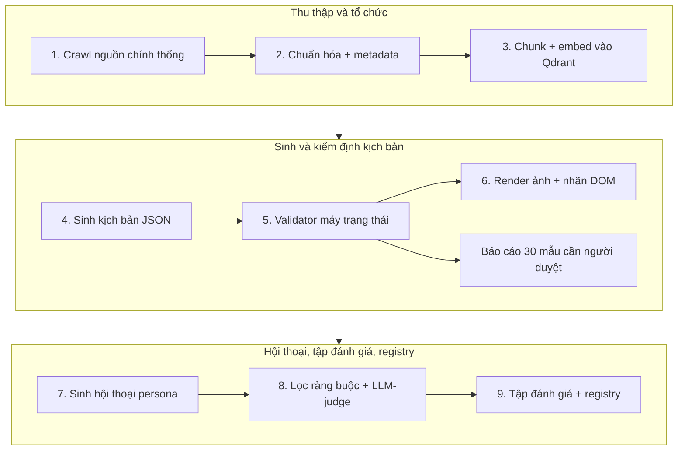

# 4. Quy trình tiền xử lý, làm sạch, chuẩn hóa hoặc tổ chức dữ liệu

> Nội dung trình bày: Mô tả ngắn quy trình xử lý dữ liệu trước khi đưa vào mô hình hoặc sản phẩm, gồm: lựa chọn dữ liệu, loại bỏ dữ liệu sai lệch, làm sạch, chuẩn hóa, phân loại, gán nhãn hoặc tổ chức dữ liệu, nếu có.

Toàn bộ quy trình chạy bằng một lệnh `make data` (Hình 1), tái lập được (seed cố định, checksum ghi vào registry) và chỉ dừng ở một bước cần con người: báo cáo HTML với 30 mẫu gắn cờ để đội duyệt hoặc sửa.

| Bước | Đầu vào → đầu ra | Làm sạch / chuẩn hóa | Kiểm soát chất lượng |
| --- | --- | --- | --- |
| 1. Crawl | `data/sources.yaml` (50–150 URL/PDF đã duyệt) → `data/raw/guides/` + `manifest.jsonl` (url, fetched_at, sha256, source_type) | robots.txt, 1 yêu cầu/giây; SPA render bằng Playwright; PDF trích bằng PyMuPDF | Bỏ trang không có nội dung hướng dẫn; cảnh báo khi hash đổi |
| 2. Chuẩn hóa | HTML/PDF → Markdown có tiêu đề, bước, cơ quan ban hành, ngày cập nhật | Loại quảng cáo/menu; chuẩn hóa Unicode NFC; bỏ trang < 200 từ | Kiểm tra bảng mã; ưu tiên văn bản có ngày hiệu lực mới nhất |
| 3. Chunk + embed | Markdown → Qdrant `guides_v{n}` (bge-m3 dense + BM25 sparse) | Chunk theo **bước hướng dẫn**, giữ metadata cơ quan và ngày | Recall@5 ≥ 0,9 trên 100 câu hỏi có nhãn |
| 4. Sinh kịch bản | Hướng dẫn + 4 kịch bản mẫu viết tay (few-shot) → `sandbox/scenarios/<slug>-l<mức>.json` | Ép theo JSON Schema: màn hình, phần tử, hành động hợp lệ, lỗi thường gặp, `never_ask` | Validator từ chối màn hình không đến được, thiếu lối ra, hành động trỏ phần tử không tồn tại, câu huấn luyện viên > 2 câu hoặc có thuật ngữ, thiếu nhãn "Ứng dụng mô phỏng"; 30 mẫu/vòng duyệt tay |
| 5. Render ảnh | Kịch bản + Playwright → `data/ui/images/*.png` + `labels/*.json` | 6 viewport; khung lấy từ DOM | Loại ảnh có khung rỗng hoặc chồng lấn |
| 6. Sinh hội thoại | 5 persona (giọng miền, hay nhầm, lo lắng, vội, cẩn thận) × kịch bản × lỗi | Mỗi lượt ≤ 2 câu, kết thúc bằng hành động có màu và chữ trên nút, xác nhận ý định lượt đầu | Loại hội thoại có yêu cầu OTP/mật khẩu, thuật ngữ, câu > 25 từ, dữ kiện ngoài kho; LLM-judge 1–5, giữ ≥ 4; 30 mẫu duyệt tay |
| 7. Kịch bản lừa đảo | Cảnh báo công khai → `drills/scenarios/*.json` | Chỉ mẫu hành vi: kênh, vai mạo danh (danh mục), mã dấu hiệu, 1 lượt thoại ≤ 40 từ có nhãn "[Mô phỏng]", 3–4 lựa chọn, giải thích ≤ 2 câu | Validator cấm URL, số điện thoại, số tài khoản, tên thật, chuỗi nhiều lượt "leo thang"; duyệt tay 100% |
| 8. Tập đánh giá | Tất cả → `eval/sets/` | Seed cố định; audio VIVOS/Common Voice chỉ giữ manifest | Checksum ghi vào registry; test schema |
| 9. Registry | Mọi tập → `data/registry/datasets.yaml` | Bắt buộc: giấy phép SPDX, `redistribute`, `derived_from`, `generator_model`, `pii: none` | Test từ chối `license: unknown`; Bản kê khai đọc từ đây |

**Gán nhãn và tổ chức:** nhãn khung của ảnh giao diện lấy từ DOM nên không có sai số gán tay; nhãn "đúng/sai" của hội thoại là kết quả của bộ lọc ràng buộc cộng LLM-judge được hiệu chỉnh bằng 50 mẫu người chấm; dữ liệu pilot tổ chức theo mã số người học và phiên, không có cột định danh.
