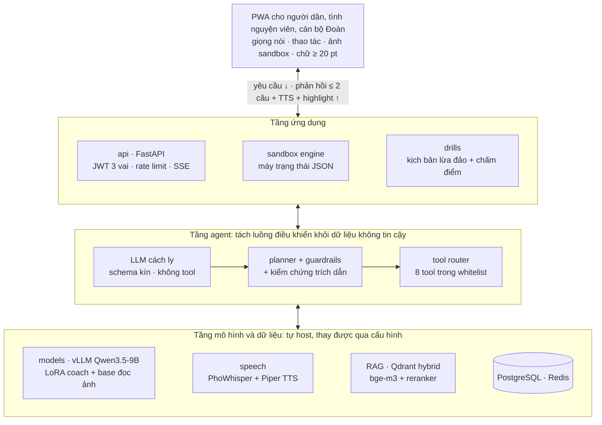

# 10. Kiến trúc hệ thống và phương án triển khai

> Nội dung trình bày: Trình bày sơ đồ hoặc mô tả ngắn kiến trúc hệ thống, các thành phần chính, luồng xử lý và phương án triển khai sản phẩm trong môi trường thử nghiệm hoặc thực tế.

## 10.1. Kiến trúc

CTCV là một agent huấn luyện viên có công cụ trên mô hình tự host, với tầng bảo mật tách luồng điều khiển khỏi dữ liệu không tin cậy; mọi thành phần AI thay được qua cấu hình để phù hợp thử thách cải tiến 12 giờ ở chung kết.

| Dịch vụ | Công nghệ | Trách nhiệm | Cổng |
| --- | --- | --- | --- |
| web | React 18 + Vite + TypeScript, PWA, Tailwind | Giao diện ba vai; ghi âm, phát TTS; offline cho màn hình tĩnh và clip TTS sinh sẵn | 5173 dev / Caddy 443 |
| api | FastAPI, SQLAlchemy 2, Alembic, Pydantic v2 | Auth (QR vào lớp, đăng nhập TNV), lớp học, phiên sandbox (SSE), báo cáo; điều phối agent | 8000 |
| agent | Python, vLLM client, Qdrant client | Planner, LLM cách ly, tool router, guardrails, kiểm chứng trích dẫn | 8010 |
| speech | faster-whisper (PhoWhisper-small INT8), Piper | ASR trong bộ nhớ, TTS stream theo câu có cache | 8020 |
| vision | Qwen3.5-9B qua vLLM | Ảnh sandbox → JSON kín, khung highlight; ảnh tự xóa sau 60 s | 8030 |
| models | vLLM (OpenAI-compatible) hoặc llama.cpp (đường CPU) | Phục vụ LLM/VLM/judge | 8040 |
| Dữ liệu, hạ tầng | PostgreSQL 16, Redis 7, Qdrant 1.x, Caddy 2, Uptime Kuma | 9 bảng (không cột định danh), stream sự kiện, vector, HTTPS tự động, trang status | 5432 / 6379 / 6333 / 443 / 3001 |

**Ba luồng xử lý và ngân sách độ trễ:**

1. **Bước sandbox (p95 < 1 s):** thao tác → engine quyết định bước kế → câu huấn luyện viên sinh sẵn theo (kịch bản, màn hình, lỗi) + clip TTS cache → highlight; không gọi LLM trực tuyến.
2. **Hỏi đáp / kèm cặp (p95 < 4 s, âm thanh đầu tiên < 1,5 s):** ASR trên GPU → phân loại ý định bằng rule/embedding → planner chọn tool → `search_guides` → `verify_citation` (reranker) → câu ≤ 2 câu stream SSE → TTS theo câu; dưới ngưỡng tin cậy → `escalate_to_volunteer`.
3. **Vắc-xin lừa đảo:** `/drills` chọn biến thể phía server (không endpoint liệt kê), chấm điểm bằng rule, giải thích dấu hiệu, "3 việc phải làm".

## 10.2. Phương án triển khai

| Thành phần | Triển khai | Tài nguyên |
| --- | --- | --- |
| Tầng luôn bật | VPS CPU: web, api, agent, PostgreSQL, Redis, Qdrant, Caddy, Uptime Kuma + đường CPU Qwen3.5-2B (llama.cpp) + PhoWhisper-tiny + TTS cache | 4 vCPU, 8 GB RAM, 40 GB SSD |
| Tầng nhanh | Máy GPU thuê: vLLM Qwen3.5-9B AWQ + ASR PhoWhisper-small; bật theo lịch (chấm hồ sơ 30/9–10/10, pilot, 18–22/11) | 1 GPU 24 GB (RTX 4090) |
| Chuyển đổi | `config/models.yaml` + health check: GPU tắt → tự chuyển sang đường CPU; trang status công khai hiển thị chế độ đang chạy | — |
| Môi trường | dev (Windows, profile `cpu`, trỏ `VLLM_BASE_URL` sang máy GPU) → staging HTTPS (điều kiện để ghi âm trên điện thoại) → prod | Compose profiles `cpu`/`gpu` |
| Giao hàng | GitHub Actions: `make check` mỗi PR (< 10 phút, không gọi mô hình); `make gate` hằng đêm trên máy GPU; deploy khi tag; rollback ≤ 2 phút; failover DNS ≤ 5 phút sang máy dự phòng cùng image | — |
| Dữ liệu | Backup PostgreSQL mỗi 6 giờ, Qdrant hằng ngày, giữ 14 bản khác máy; ảnh màn hình không backup | — |
| 48 giờ chấm chung kết | Đóng băng mã T-72h, load test, máy dự phòng T-60h, khóa nhánh T-48h, trực ca 8 giờ × 3 người, sự cố ghi `docs/ops/incidents.md` | — |

URL công khai của bản nộp: {{team:app_url|chưa công bố tại ngày lập hồ sơ — mở cùng bản Pha A}} (trang status: {{team:status_url|mở cùng URL công khai}}); thiết kế tầng luôn bật giữ URL sống liên tục từ ngày công bố đến chung kết. Dữ liệu lưu trên máy chủ tại Việt Nam (nhà cung cấp GPU trong nước cho pilot và chung kết; Cloudflare chỉ DNS-only). Chi phí toàn cuộc thi ước tính: GPU 300 giờ 5–8 triệu đồng, VPS + tên miền 1 triệu đồng, sinh dữ liệu ≤ 2 triệu đồng.
